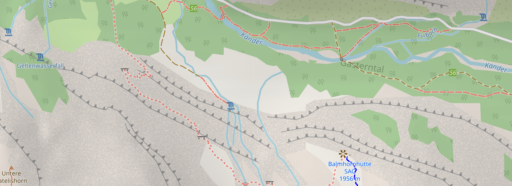

# OpenStreetMap Carto fork

These are CartoCSS map stylesheets specialized for hiking. These stylesheets are particularly useful in zoom levels 14 - 17, in areas with mountainous hiking paths. I use these for creating printed maps of Kandersteg, Switzerland, and the surrounding area.

These stylesheets can be used in your own cartography projects, and are designed
to be easily customised. They work with [Kosmtik](https://github.com/kosmtik/kosmtik)
 and also with the command-line [CartoCSS](https://github.com/mapbox/carto) processor.

# Installation

You need a PostGIS database populated with OpenStreetMap data along with auxillary shapefiles.
See [INSTALL.md](INSTALL.md).

# Contributing

Contributions to this project are welcome, see [CONTRIBUTING.md](CONTRIBUTING.md)
for full details.

# Alternatives

There are many open-source stylesheets written for creating OpenStreetMap-based
maps using Mapnik, many based on this project. Some alternatives are:

* [OpenStreetMap Carto](https://github.com/gravitystorm/openstreetmap-carto)
* [OSM-Bright](https://github.com/mapbox/osm-bright)
* [XML-based stylesheets](https://trac.openstreetmap.org/browser/subversion/applications/rendering/mapnik)
* [osmfr-cartocss](https://github.com/cquest/osmfr-cartocss)
* [openstreetmap-carto-german](https://github.com/giggls/openstreetmap-carto-de)

# Maintainers

* Sjoerd Langkemper [@Sjord](https://github.com/Sjord/)